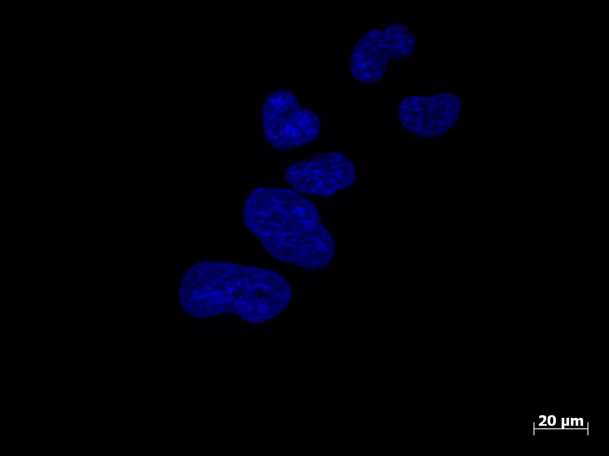
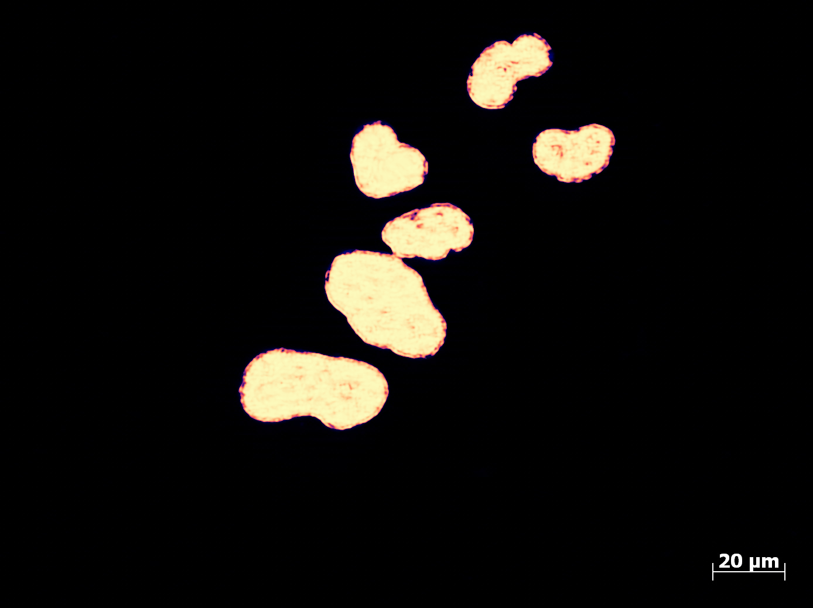
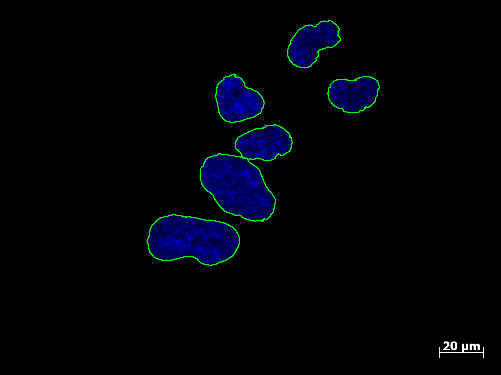
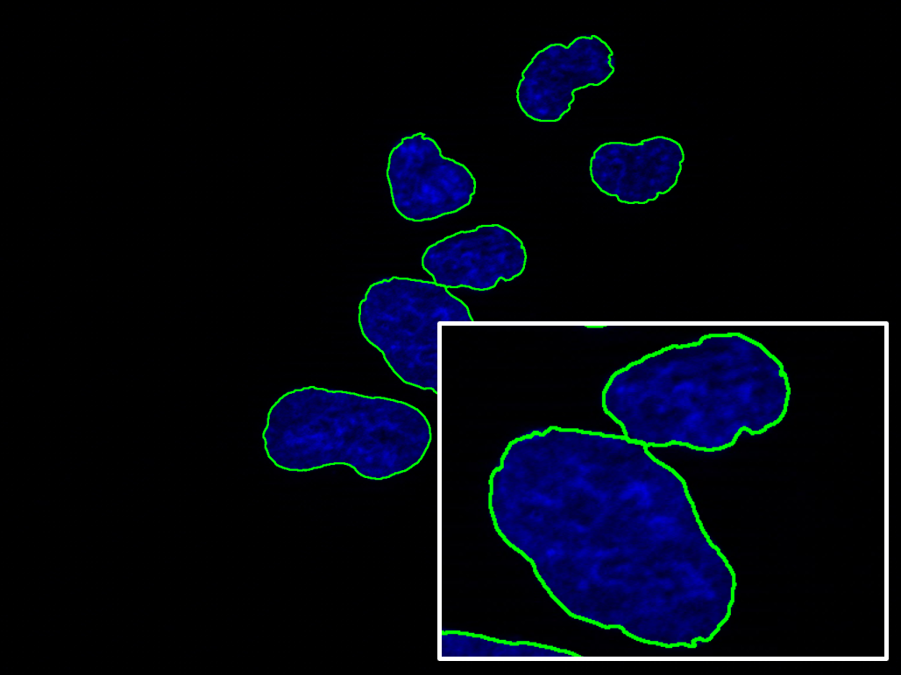

## **ANuC 自動化免疫螢光染色細胞核偵測及計數系統**
Automatic Cell Nuclei Detection and Counting System</span><br><br>

<p align="left">
  
  <br>
  <b>&emsp;&emsp;本專案提供自前處理、影像分析模型至後處理...等功能完整之整套系統。用於分析免疫螢光分析 (Immunofluorescence assay, IFA) 當中的 DAPI 通道螢光顯微照片。透過影像調整、原始圖切割、UNet 模型 (PyTorch)，至最終利用分水嶺算法進行細胞位置標記及計數。</b><br>
</p>
<br clear="left"/>

### 成果展示

<div align="center">
  <table style="border: none; border-collapse: collapse; background-color: transparent;">
    <tr style="border: none; background-color: transparent;">
      <td style="border: none; background-color: transparent; padding: 5px; width: 25%;">
        
      </td>
      <td style="border: none; background-color: transparent; padding: 5px; width: 25%;">
        
      </td>
      <td style="border: none; background-color: transparent; padding: 5px; width: 25%;">
        
      </td>
      <td style="border: none; background-color: transparent; padding: 5px; width: 25%;">
        
      </td>
    </tr>
    <tr style="border: none; background-color: transparent; font-size: 6px; font-weight: bold;">
      <td style="border: none; background-color: transparent;">FIG.1-1 Original image</td>
      <td style="border: none; background-color: transparent;">FIG.1-2 Heatmap</td>
      <td style="border: none; background-color: transparent;">FIG.1-3 Contour extraction</td>
      <td style="border: none; background-color: transparent;">FIG.1-4 Zoom in</td>
    </tr>
  </table>
</div>

### I. 流程</span><br>
<span style="font-size: 12px;">
&emsp;&emsp;請依序執行以下檔案及功能。<br><br>

1.影像前處理 (01_figure_preprocessing.ipynb)<br>
&emsp;&emsp;初次使用時先執行一次以產生所需目錄，將預定將轉為training set的訓練圖片原圖放入"preprocessing_input"資料夾，執行第二次程式將會讀取"preprocessing_input"資料夾中的圖片進行處理。輸出經數值調整、雙通道灰階及切割後圖片。<br>
技術 : 使用CLAHE調整影像直方圖<br>
&emsp;&emsp;使用Sliding Window切割影像，預設尺寸為256*256, overlap=30<br>
輸出 : 輸出.png至"preprocessing_output"及"preprocessing_check"資料夾。<br>
&emsp;&emsp;("preprocessing_check"檔案為經數值調整、雙通道灰階但未切割原尺寸圖，供人工檢查)<br><br>

2.Labelme 遮罩產生<br>
&emsp;&emsp;透過開源軟體做人工data label。在Labelme中指定讀取"preprocessing_output"資料夾，進行細胞範圍手動標記。<br>
輸出 : 輸出.json至"preprocessing_output"資料夾<br><br>

3.標記轉換 (02_cell_label_mask.ipynb)<br>
&emsp;&emsp;讀取"preprocessing_output"資料夾，將Labelme結果.json轉換成黑白遮罩圖。<br>
技術 : 使用Binary Mask二值化將Labelme生成的JSON格式轉換為黑白遮罩圖<br>
輸出 : 輸出.png至"masks_output"和"masks_check"資料夾<br>
("masks_check"檔案為合併灰階圖及遮罩，供人工檢查)<br><br>

4.數據封裝 (03_data_package_h5_generation.ipynb)<br>
&emsp;&emsp;整合影像與遮罩並寫入.h5。<br>
技術 : 使用h5py將影像與遮罩封裝成.h5<br>
輸出 : 輸出.h5至同級目錄<br><br>

5.模型訓練與預測 (04_model.ipynb)<br>
#訓練模式<br>
&emsp;&emsp;main block預設mode='prediction'，訓練時先改成mode='train'，讀取來自數據封裝結果的.h5進行訓練。<br>
&emsp;&emsp;架構 : UNet<br>
&emsp;&emsp;Loss function : BCE Loss function結合Dice Loss function<br>
#預測模式<br>
&emsp;&emsp;初次使用時先執行一次以產生所需目錄，將需要分析的影像放入"prediction_input"資料夾，設定mode='prediction'，讀取作者提供同級目錄的預訓練權重紀錄(或自行訓練的權重紀錄)進行預測，輸出probability map。<br>
&emsp;&emsp;技術 : 使用weight mask處理邊界拼時的痕跡<br>
&emsp;&emsp;輸出 : 輸出.h5至"prediction_result"資料夾<br><br>

6.後處理及計數 (05_post_processing.ipynb)<br>
&emsp;&emsp;讀取"prediction_result"資料夾中的.h5，將probability map轉換為label map, heatmap及計數輸出(兩類輸出圖及統計數字皆不包含接觸影像邊界的細胞)。<br>
技術 : 使用distance transform計算距離變換<br>
&emsp;&emsp;使用Watershed algorithm對細胞核區域做分割<br>
輸出 : 輸出一個輸入.h5對應檔名的資料夾，在資料夾中輸出label map, heatmap及原圖的.png檔案及.txt計數結果<br>

### Pipeline Architecture
<span style="font-size: 12px;">
<div align="center">
<br><br>
</div>

### II. 環境需求</span><br>
<span style="font-size: 12px;">
&emsp;&emsp;*開發環境Python 3.13, PyTorch 2.10, Labelme 5.10, Jupyter Notebook 7.5, JupyterLab 4.5<br>
&emsp;&emsp;*建議使用 conda 或 venv 建立虛擬環境<br>
&emsp;&emsp;*自行建立訓練集時需下載Labelme套件<br><br>
#安裝套件

```bash
pip install numpy pandas opencv-python scikit-image matplotlib torch torchvision h5py scipy
```
<br>
#安裝Labelme

```bash
pip install labelme
```

### III. 未來計畫</span><br>
&emsp;&emsp;最初專案建地動機為作者過去任職wet lab進行研究與開發工作，執行IFA蛋白質位置overlap分析時遇到細胞分割困難、計算繁瑣且耗時，因此嘗試開發更省時的自動化系統。目前版本先完成對細胞核位置的定位與細胞分割部分。未來將強化細胞分割與形狀認知能力，並加入IFA其他通道圖並合併Merge圖分析。
<br><br>


### 特別感謝</span><br>
感謝 <a href="https://www.erixnet.com/">EriXNet</a> 對開發的協助與顧問工作


### 關於作者<br>
林修渝 Hsiu-Yu, Lin</span><br>
<span style="font-size: 12px; font-weight: bold;">
臺灣人，來自台南市。喜歡戰錘40k、喜歡音樂、喜歡騎車、喜歡一切亂七八糟對工作沒什麼幫助的事情。<br><br>
生物化學碩士，曾任職中央研究院生醫所研究助理，現職為人工智慧生物醫學資料科學家。專長是生物化學、癌症細胞生物學、外泌體分析及生物醫學影像分析。<br>
GitHub : https://github.com/hsiuyulin09
</span>
<br><br>

<span style="font-size: 12px; font-weight: bold;">


&emsp;
&emsp;
&emsp;

</span>


