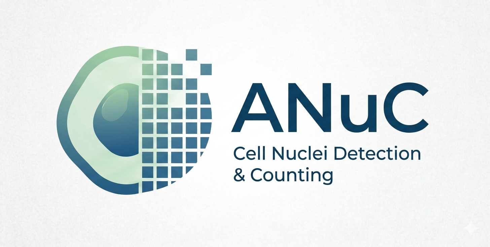
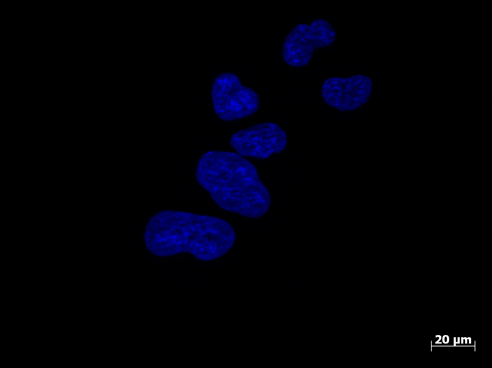
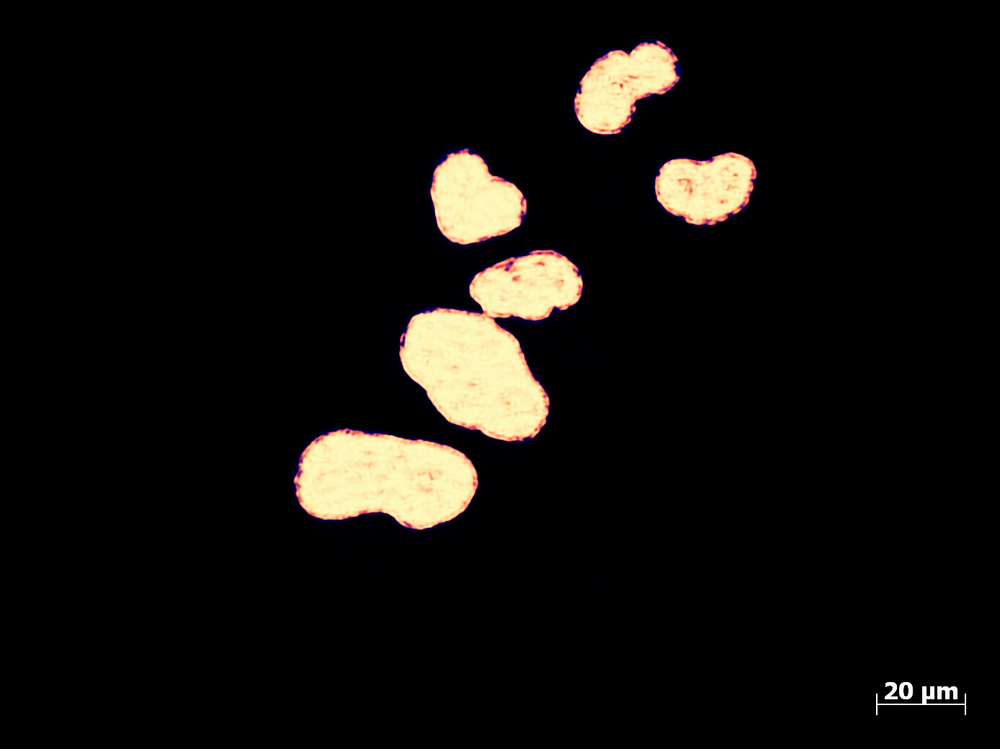
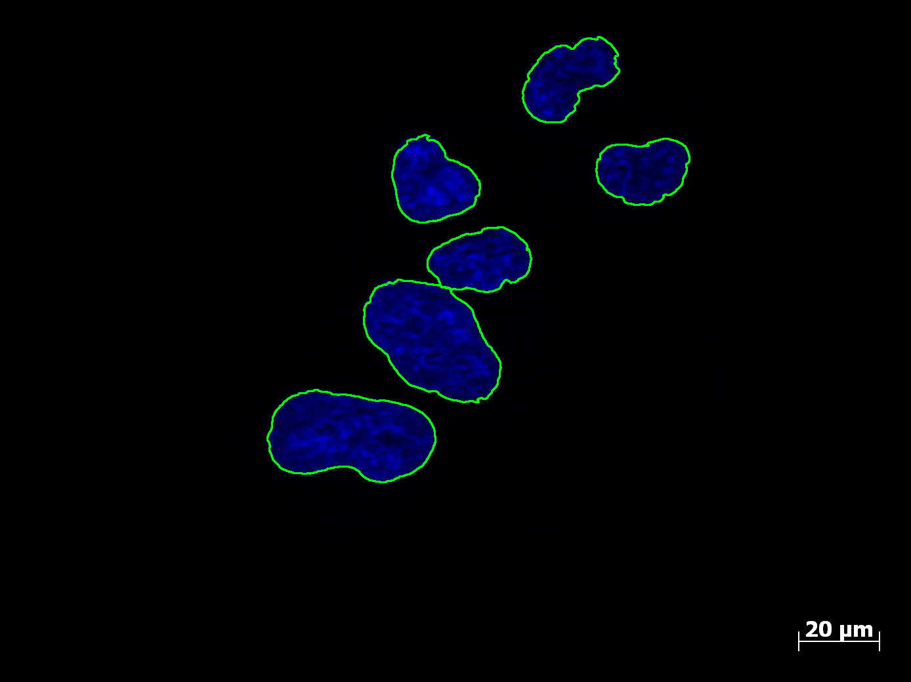
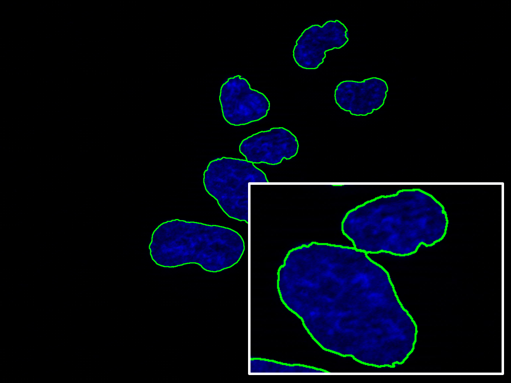

## **ANuC 自動化免疫螢光染色細胞核偵測及計數系統**
Automatic Cell Nuclei Detection and Counting System</span><br><br>

<p align="left">
  
  <br>
  <b><a name="start"></a>本專案提供自前處理、影像分析模型至後處理...等功能完整之整套系統。用於分析免疫螢光分析 (Immunofluorescence assay, IFA) 當中的 DAPI 通道螢光顯微照片。透過影像調整、原始圖切割、UNet 模型 (PyTorch)，至最終利用分水嶺算法進行細胞位置標記及計數。</b><br>
</p>
<br clear="left"/>

### 成果展示

<div align="center">
  <table style="border: none; border-collapse: collapse; background-color: transparent;">
    <tr style="border: none; background-color: transparent;">
      <td style="border: none; background-color: transparent; padding: 5px; width: 25%;">
        
      </td>
      <td style="border: none; background-color: transparent; padding: 5px; width: 25%;">
        
      </td>
      <td style="border: none; background-color: transparent; padding: 5px; width: 25%;">
        
      </td>
      <td style="border: none; background-color: transparent; padding: 5px; width: 25%;">
        
      </td>
    </tr>
    <tr style="border: none; background-color: transparent; font-size: 6px; font-weight: bold;">
      <td style="border: none; background-color: transparent;">FIG.1-1 Original image</td>
      <td style="border: none; background-color: transparent;">FIG.1-2 Heatmap</td>
      <td style="border: none; background-color: transparent;">FIG.1-3 Contour extraction</td>
      <td style="border: none; background-color: transparent;">FIG.1-4 Zoom in</td>
    </tr>
  </table>
</div>
<br>

---

### **目錄** </span><br>
[簡介](#start)<br>
[成果展示](#成果展示)<br>
[I. 流程](#i-流程)<br>
&emsp;[1. 影像前處理](#step1)<br>
&emsp;[2. Labelme 遮罩產生](#step2)<br>
&emsp;[3. 標記轉換](#step3)<br>
&emsp;[4. 數據封裝](#step4)<br>
&emsp;[5. 模型訓練與預測](#step5)<br>
&emsp;[6. 後處理及計數](#step6)<br>
&emsp;[Pipeline Architecture](#pipeline-architecture)<br>
[II.環境需求](#ii-環境需求)<br>
[III.未來計畫](#iii-未來計畫)<br>
[特別感謝](#特別感謝)<br>
[關於作者](#關於作者)<br>

---

### I. 流程</span><br>
<span style="font-size: 12px;">
請依序執行以下檔案及功能。<br><br>

1. 影像前處理 ( `01_figure_preprocessing.ipynb` )<a name="step1"></a><br>
初次使用時先執行一次以產生所需目錄，將預定將轉為 training set 的訓練圖片原圖放入 `preprocessing_input` 資料夾，執行第二次程式將會讀取 `preprocessing_input` 資料夾中的圖片進行處理。輸出經數值調整、雙通道灰階及切割後圖片。<br>
    * 技術 : 使用 CLAHE 調整影像直方圖<br>
使用 Sliding Window 切割影像，預設尺寸為 `tile_size=256`, `overlap=30`<br>
    * 輸出 : 輸出 `.png` 至 `preprocessing_output` 及 `preprocessing_check` 資料夾。<br>
      (`preprocessing_check` 檔案為經數值調整、雙通道灰階但未切割原尺寸圖，供人工檢查)<br><br>

2. Labelme 遮罩產生<a name="step2"></a><br>
透過開源軟體做人工 data label。在 Labelme 中指定讀取 `preprocessing_output` 資料夾，進行細胞範圍手動標記。<br>
    * 輸出 : 輸出 `.json` 至 `preprocessing_output` 資料夾<br><br>

3. 標記轉換 ( `02_cell_label_mask.ipynb` )<a name="step3"></a><br>
讀取 `preprocessing_output` 資料夾，將 Labelme 結果 `.json` 轉換成黑白遮罩圖。<br>
    * 技術 : 使用 Binary Mask 二值化將 Labelme 生成的 `.json` 格式轉換為黑白遮罩圖<br>
    * 輸出 : 輸出 `.png` 至 `masks_output` 和 `masks_check` 資料夾<br>
( `masks_check` 資料夾為合併灰階圖及遮罩，供人工檢查)<br><br>

4. 數據封裝 ( `03_data_package_h5_generation.ipynb` )<a name="step4"></a><br>
整合影像與遮罩並寫入 `.h5`。<br>
    * 技術 : 使用 h5py 將影像與遮罩封裝成 `.h5`<br>
    * 輸出 : 輸出 `.h5` 至同級目錄<br><br>

5. 模型訓練與預測 ( `04_model.ipynb` )<a name="step5"></a><br>
    * 訓練模式<br>
      `main block` 預設 `mode='prediction'`，訓練時先改成 `mode='train'`，讀取來自數據封裝結果的 `.h5` 進行訓練。<br>
      * 架構 : UNet<br>
      * Loss function : BCE Loss function 結合 Dice Loss function<br>
    * 預測模式<br>
      初次使用時先執行一次以產生所需目錄，將需要分析的影像放入 `prediction_input` 資料夾，設定 `mode='prediction'`，讀取作者提供同級目錄的預訓練權重紀錄 (或自行訓練的權重紀錄) 進行預測，輸出 probability map。<br>
      * 技術 : 使用 weight mask 處理邊界拼時的痕跡<br>
      * 輸出 : 輸出 `.h5` 至 `prediction_result` 資料夾<br><br>

6. 後處理及計數 ( `05_post_processing.ipynb` )<a name="step6"></a><br>
讀取 `prediction_result` 資料夾中的 `.h5`，將 probability map 轉換為 label map, heatmap 及計數輸出(兩類輸出圖及統計數字皆不包含接觸影像邊界的細胞)。<br>
    * 技術 : 使用 distance transform 計算距離變換<br>
使用 Watershed algorithm 對細胞核區域做分割<br>
    * 輸出 : 輸出一個輸入 `.h5` 對應檔名的資料夾，在資料夾中輸出 label map, heatmap 及原圖的 `.png` 檔案及 `.txt` 計數結果<br>

### Pipeline Architecture <a name="pipeline-architecture"></a>
<span style="font-size: 12px;">
<div align="center">
<br><br>
</div>

### II. 環境需求</span><br>
<span style="font-size: 12px;">

* 開發環境 `Python 3.13`, `PyTorch 2.10`, `Labelme 5.10`, `Jupyter Notebook 7.5`, `JupyterLab 4.5`<br>
* 建議使用 `conda` 或 `venv` 建立虛擬環境<br>
* 自行建立訓練集時需下載 `labelme` 套件<br><br>

* 安裝套件

```bash
pip install numpy pandas opencv-python scikit-image matplotlib torch torchvision h5py scipy
```


* 安裝Labelme

```bash
pip install labelme
```

### III. 未來計畫</span><br>
最初專案建地動機為作者過去任職 wet lab 進行研究與開發工作，執行 IFA 蛋白質位置 overlap 分析時遇到細胞分割困難、計算繁瑣且耗時，因此嘗試開發更省時的自動化系統。目前版本先完成對細胞核位置的定位與細胞分割部分。未來將強化細胞分割與形狀認知能力，並加入IFA其他通道圖並合併 Merge 圖分析 prorein colocolization。
<br><br>


### 特別感謝</span><br>
感謝 <a href="https://www.erixnet.com/">EriXNet</a> 對開發的協助與顧問工作<br><br>

---

### 關於作者<br>
林修渝 Hsiu-Yu, Lin</span><br>
<span style="font-size: 12px; font-weight: bold;">
臺灣人，來自台南市。喜歡戰錘40k、喜歡音樂、喜歡騎車、喜歡一切亂七八糟對工作沒什麼幫助的事情。<br>
生物化學碩士，曾任職中央研究院生醫所研究助理，現職為人工智慧生物醫學資料科學家。專長是生物化學、癌症細胞生物學、外泌體分析及生物醫學影像分析。<br><br>
Hsiu-Yu, Lin</span><br>
A biomedical data scientist hailing from Tainan, Taiwan. I’m passionate about Warhammer 40k, music, motorcycle touring, and baseball. Basically, anything and everything that has absolutely nothing to do with my job.<br>
I am a Master of Biochemistry and a former Research Assistant at the Institute of Biomedical Science, Academia Sinica. Now, I work as an AI Biomedical Data Scientist, and specialize in biochemistry, cancer biology, and biomedical image analysis.<br><br>
GitHub : https://github.com/hsiuyulin09
</span>
<br><br>

<span style="font-size: 12px; font-weight: bold;">


&emsp;
&emsp;
&emsp;

</span>


